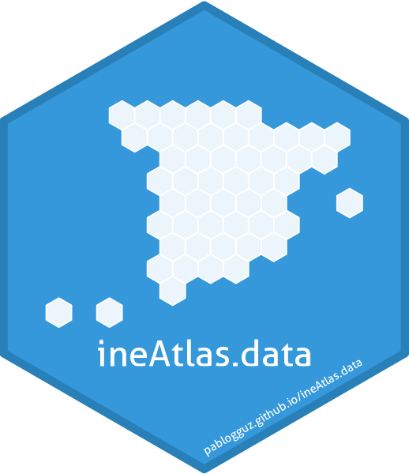

# ineAtlas.data 

> [!WARNING]  
> This repository and its accompanying R package are currently under development. Check back soon for updates!

## About

This is the data repository accompanying the [`ineAtlas`](https://github.com/pablogguz/ineAtlas) R package. It contains processed and standardized data from the Spanish Statistical Office (Instituto Nacional de Estadística, INE) _Atlas de Distribución de Renta de los Hogares_, which provides socioeconomic indicators at the municipal, district, and census tract level for Spain.

While the data can be used independently, it is designed to work seamlessly with the `ineAtlas` package to facilitate fetching and downloading the data.

See the [`ineAtlas`](https://github.com/pablogguz/ineAtlas) package documentation for complete usage instructions and examples.*

## Data structure

The repository is organized into the following directories:

```
ineAtlas.data/
├── income/
│   ├── income_municipality.csv
│   ├── income_district.csv
│   └── income_tract.csv
├── income_sources/
│   ├── income_sources_municipality.csv
│   ├── income_sources_district.csv
│   └── income_sources_tract.csv
├── demographics/
│   ├── demographics_municipality.csv
│   ├── demographics_district.csv
│   └── demographics_tract.csv
├── distribution_sex/
│   ├── distribution_sex_municipality.csv
│   ├── distribution_sex_district.csv
│   └── distribution_sex_tract.csv
├── distribution_sex_age/
│   ├── distribution_sex_age_municipality.csv
│   ├── distribution_sex_age_district.csv
│   └── distribution_sex_age_tract.csv
├── distribution_sex_nationality/
│   ├── distribution_sex_nationality_municipality.csv
│   ├── distribution_sex_nationality_district.csv
│   └── distribution_sex_nationality_tract.csv
└── gini_p80p20/
    ├── gini_p80p20_municipality.csv
    ├── gini_p80p20_district.csv
    └── gini_p80p20_tract.csv
```

## Documentation

Full documentation and codebook is available at [https://pablogguz.github.io/ineAtlas.data](https://pablogguz.github.io/ineAtlas.data)

## Updates

This repository is automatically updated when new data is released by INE using the data processing pipeline in the main [`ineAtlas`](https://github.com/pablogguz/ineAtlas) repository.

## Author

Pablo García Guzmán  
